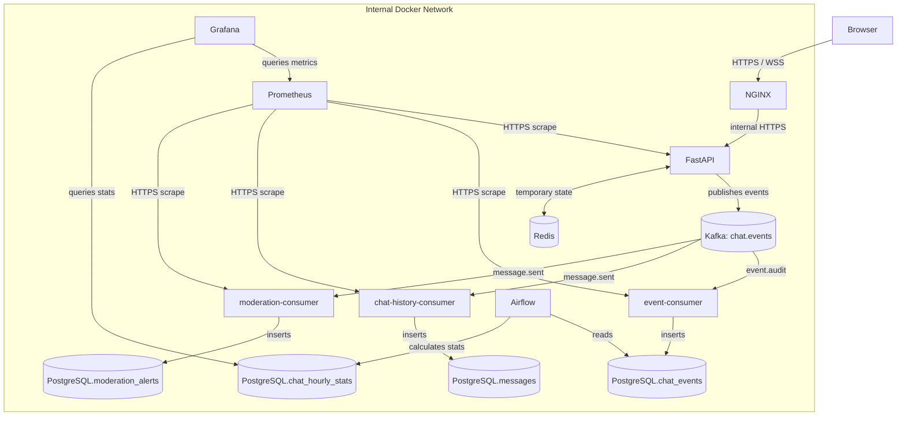
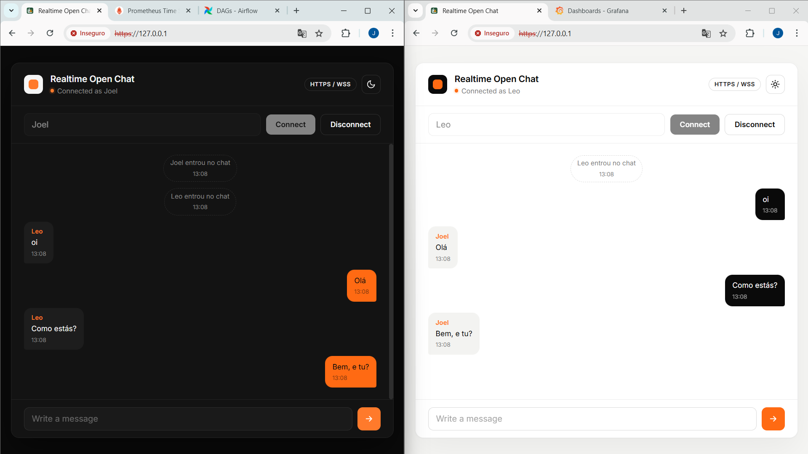
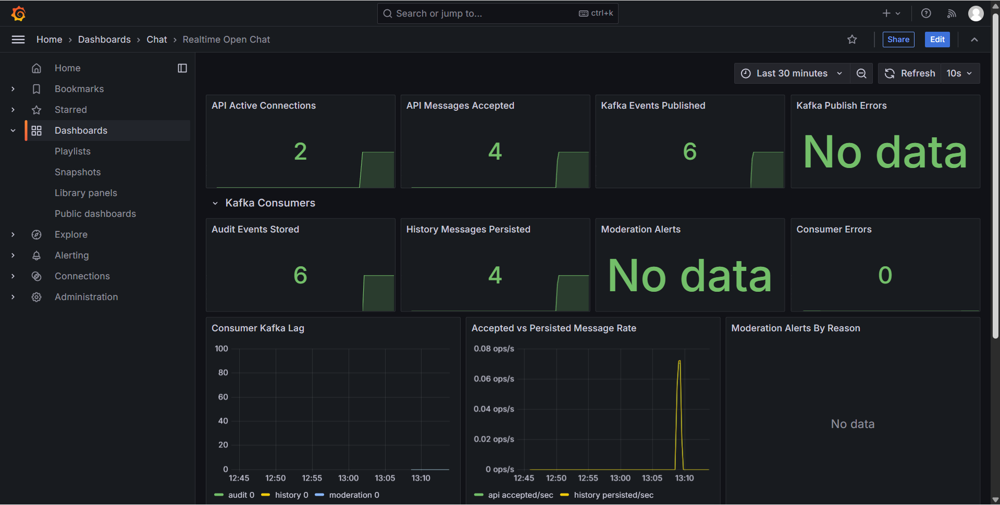
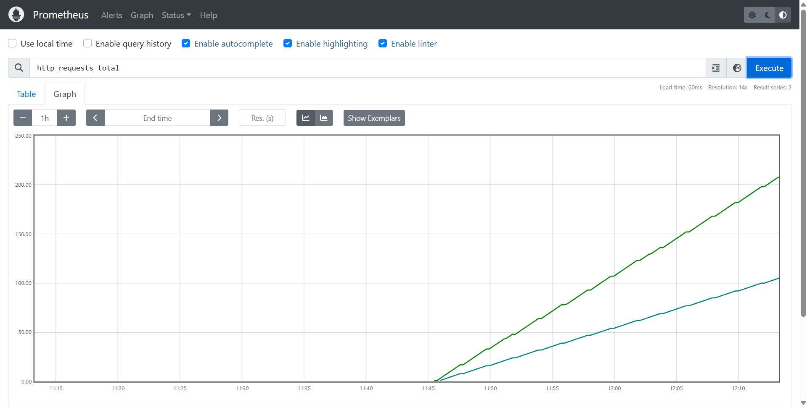
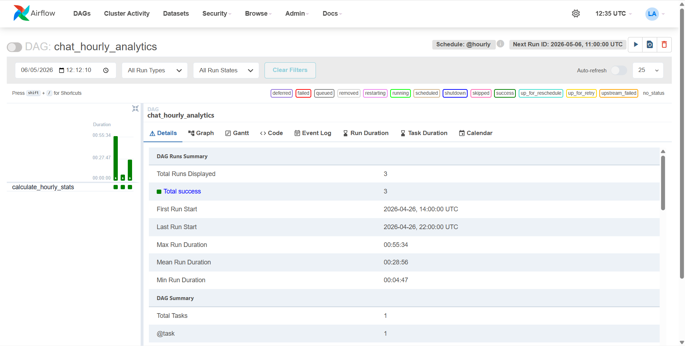

# realtime-open-chat-infra

A realtime open chat application built as a hands-on lab for backend engineering, WebSocket communication, Docker infrastructure, HTTPS, observability, event streaming, and asynchronous processing.

This project is not trying to be a production-ready chat platform. Its goal is narrower and more intentional: show how a small application can be split into clear responsibilities using FastAPI, Kafka, PostgreSQL, Redis, Prometheus, Grafana, Airflow, and NGINX with a local self-signed certificate setup.

The chat itself is intentionally simple. A user enters a name, connects through a secure WebSocket, sends messages, and every connected user receives those messages. The interesting part is what happens after each event moves through the system.

## Table Of Contents

- [Overview](#overview)
- [What This Project Demonstrates](#what-this-project-demonstrates)
- [Communication Map](#communication-map)
- [Main Chat Flow](#main-chat-flow)
- [Kafka And Consumers](#kafka-and-consumers)
- [Eventual Consistency And UUIDs](#eventual-consistency-and-uuids)
- [Service Responsibilities](#service-responsibilities)
- [Technology Breakdown](#technology-breakdown)
- [Data Model](#data-model)
- [HTTPS, WSS, And Certificates](#https-wss-and-certificates)
- [Prerequisites](#prerequisites)
- [How To Run](#how-to-run)
- [Secrets And Environment](#secrets-and-environment)
- [Access URLs](#access-urls)
- [Makefile Commands](#makefile-commands)
- [Environment Variables](#environment-variables)
- [Repository Structure](#repository-structure)
- [Screenshots](#screenshots)
- [Validation](#validation)
- [Private Services](#private-services)
- [Lab Limits](#lab-limits)
- [Future Improvements](#future-improvements)

## Overview

The application has one public entry point: NGINX. The browser loads the UI over HTTPS and opens the chat socket over WSS. The FastAPI service also runs with TLS inside the Docker network, so NGINX talks to the API over internal HTTPS.

The realtime chat logic lives in the API, but secondary effects are moved into Kafka consumers:

- the API accepts connections, validates messages, broadcasts to clients, and publishes events;
- Kafka stores the stream of chat events;
- `event-consumer` writes raw events to `chat_events`;
- `chat-history-consumer` writes chat messages to `messages`;
- `moderation-consumer` inspects messages and writes alerts to `moderation_alerts`;
- Prometheus collects metrics;
- Grafana visualizes operational metrics and hourly analytics;
- Airflow calculates hourly analytics from the audited event history.

With this design, Kafka is not included just as a decorative service. It becomes the distribution point for chat facts.

## What This Project Demonstrates

- Secure WebSocket communication with WSS.
- FastAPI running with internal TLS.
- HTTPS reverse proxying with NGINX.
- Self-signed certificates generated from a local CA.
- PostgreSQL for durable data.
- Redis for temporary online-user state.
- Kafka as an event log.
- Independent consumers for auditing, message persistence, and moderation.
- Prometheus scraping metrics over HTTPS.
- Grafana dashboards for the API, consumers, and hourly chat analytics.
- Airflow running scheduled analytics outside the realtime path.
- Docker Compose with private networks for internal services.

## Communication Map



## Main Chat Flow

When a user enters the chat, the browser opens:

```txt
wss://localhost/ws/{username}
```

NGINX receives that secure connection and forwards it to the API over internal HTTPS. The API accepts the WebSocket, registers the user as online in Redis, publishes `user.joined` to Kafka, and broadcasts a system message to all connected clients:

```txt
{username} entered the chat
```

When a message is sent, the API validates the content, creates a `message_id`, publishes `message.sent` to Kafka, and broadcasts the message to connected clients. The API no longer writes the message directly to `messages`; that responsibility belongs to `chat-history-consumer`.

When a user leaves, the WebSocket closes. The API removes the connection, updates Redis, publishes `user.left` to Kafka, and broadcasts:

```txt
{username} left the chat
```

## Kafka And Consumers

Kafka stores events such as:

```txt
user.joined
message.sent
user.left
```

A message event looks conceptually like this:

```json
{
  "event_id": "event-uuid",
  "event_type": "message.sent",
  "username": "joel",
  "payload": {
    "message_id": "message-uuid",
    "content": "Hello everyone",
    "content_length": 14
  },
  "timestamp": "2026-04-26T20:00:00Z"
}
```

The same event feeds different consumers:

```txt
chat.events
  |
  |-- event-consumer
  |-- chat-history-consumer
  |-- moderation-consumer
```

### event-consumer

This consumer stores the raw fact. It consumes every event and writes it to:

```txt
PostgreSQL.chat_events
```

It answers:

```txt
What exactly happened in the system?
```

This table is also the input used by Airflow to calculate hourly statistics.

### chat-history-consumer

This consumer processes only `message.sent` events and writes chat messages to:

```txt
PostgreSQL.messages
```

It answers:

```txt
Which messages belong to the chat history?
```

This moves message persistence out of the API. The API focuses on realtime communication; the consumer focuses on durable writes.

### moderation-consumer

This consumer also processes `message.sent`, but for a different reason. It inspects the message and looks for simple abuse signals:

- blocked words;
- overly long messages;
- repeated messages in a short window;
- flooding with several messages in a few seconds.

When it finds something, it writes an alert to:

```txt
PostgreSQL.moderation_alerts
```

It answers:

```txt
Did anything suspicious happen in the chat?
```

In this first version, it does not block messages. It only records alerts. That keeps the realtime flow simple and makes moderation visible as an independent process.

## Eventual Consistency And UUIDs

After adding `chat-history-consumer`, message persistence became asynchronous.

The old shape would be:

```txt
API receives message
API writes to database
API broadcasts to chat
```

The new shape is:

```txt
API receives message
API generates message_id
API publishes message.sent to Kafka
API broadcasts to chat
chat-history-consumer writes to the database shortly after
```

This means a message can appear in the chat a few milliseconds before it exists in `messages`. The system becomes consistent once the consumer processes the event.

To make this model work, the API generates UUIDs:

```txt
event_id   = identifies the event published to Kafka
message_id = identifies the chat message
```

The `message_id` does not depend on PostgreSQL's incremental ID because the API needs to identify the message before the database writes it. The consumer uses that same `message_id` in the `messages` table.

There is also an idempotency rule:

```txt
message_id UNIQUE
```

If Kafka redelivers the same event, the consumer may try to write it again, but the database safely ignores the duplicate.

## Service Responsibilities

| Service | Responsibility |
|---|---|
| Browser | Chat interface using HTTPS and WSS. |
| NGINX | Main entry point, public TLS, reverse proxying, and WebSocket upgrade. |
| FastAPI | WebSocket handling, validation, broadcasting, Redis online users, and Kafka event publication. |
| PostgreSQL | Durable data: messages, events, moderation alerts, and analytics. |
| Redis | Temporary online-user state. |
| Kafka | Chat event log and distribution point for independent consumers. |
| event-consumer | Persists every raw event into `chat_events`. |
| chat-history-consumer | Persists `message.sent` events into `messages`. |
| moderation-consumer | Detects simple abuse signals and writes `moderation_alerts`. |
| Prometheus | Scrapes metrics over HTTPS. |
| Grafana | Visualizes operational metrics from Prometheus and hourly analytics from PostgreSQL. |
| Airflow | Calculates hourly analytics from `chat_events`. |
| Docker Compose | Orchestrates the local stack and separates public/private networks. |

## Technology Breakdown

### FastAPI

FastAPI is the chat backend. It accepts WebSockets, validates messages with Pydantic, exposes `/api/health`, `/api/online-users`, and `/metrics` inside the Docker network, and publishes events to Kafka. It does not connect to PostgreSQL; durable writes belong to the consumers.

### WebSocket

WebSocket keeps an open connection between the browser and the backend. This allows immediate broadcast of joins, leaves, and messages.

### NGINX

NGINX is the only public entry point. It serves the frontend over HTTPS, redirects port 80 to HTTPS, proxies API and WebSocket traffic to the API over internal HTTPS, and forwards routes for Grafana, Prometheus, and Airflow. It does not expose the API `/metrics` endpoint publicly; Prometheus scrapes that endpoint from inside the Docker network.

### PostgreSQL

PostgreSQL is the durable database. It stores chat messages, audited events, moderation alerts, and hourly statistics. Its schema is initialized from `postgres/init.sql` when the database volume is created.

### Redis

Redis stores temporary state. In this project, it tracks online users and active sessions. This data is useful operationally, but it is not treated as permanent history.

### Kafka

Kafka is used as the event log. The API publishes facts, and consumers process those facts independently.

The useful pattern appears when one event creates multiple effects:

```txt
message.sent
  -> message history
  -> event audit
  -> moderation
```

### Prometheus

Prometheus collects technical metrics over HTTPS:

- active WebSocket connections;
- messages accepted by the API;
- Kafka events published;
- events audited;
- messages persisted by the history consumer;
- moderation alerts;
- consumer errors and lag.

### Grafana

Grafana uses two datasources. Prometheus feeds the realtime operational dashboard for API, Kafka, and consumer health. PostgreSQL feeds the `Chat Hourly Analytics` dashboard from `chat_hourly_stats`, which is calculated by Airflow.

### Airflow

Airflow does not participate in the realtime chat path. It runs the `chat_hourly_analytics` DAG, reads `chat_events`, and writes aggregates into `chat_hourly_stats`.

### OpenSSL

OpenSSL generates the local CA and the certificates for NGINX, the API, and the consumers. The goal is to demonstrate end-to-end HTTPS/WSS in a local environment.

## Data Model

### messages

Stores messages persisted by `chat-history-consumer`.

```txt
id
message_id
username
content
created_at
```

### chat_events

Stores raw events persisted by `event-consumer`.

```txt
id
event_id
event_type
username
payload
created_at
```

### moderation_alerts

Stores alerts created by `moderation-consumer`.

```txt
id
event_id
message_id
username
reason
severity
content_preview
payload
created_at
```

### chat_hourly_stats

Stores statistics calculated by Airflow.

```txt
id
hour
total_messages
total_joins
total_leaves
created_at
```

## HTTPS, WSS, And Certificates

The project uses self-signed certificates. The script generates:

```txt
certs/
|-- ca.crt
|-- ca.key
|-- nginx.crt
|-- nginx.key
|-- api.crt
|-- api.key
|-- event-consumer.crt
|-- event-consumer.key
|-- chat-history-consumer.crt
|-- chat-history-consumer.key
|-- moderation-consumer.crt
`-- moderation-consumer.key
```

The certificates use SANs for:

```txt
localhost
127.0.0.1
nginx
api
event-consumer
chat-history-consumer
moderation-consumer
```

The browser accesses:

```txt
https://localhost
```

The frontend opens a secure WebSocket:

```txt
wss://localhost/ws/{username}
```

Internally, NGINX talks to the API through:

```txt
https://api:8443
```

Prometheus also scrapes HTTPS endpoints using the local CA.

## Prerequisites

To run this project locally, ensure you have the following installed:

- **Docker** and **Docker Compose**: To orchestrate the services.
- **Make**: To use the provided Makefile commands for easier execution.
- **OpenSSL**: For generating local self-signed certificates (usually pre-installed on Linux/macOS or available via Git Bash/WSL on Windows).

## How To Run

Create local secret files:

```bash
make secrets
```

Generate certificates:

```bash
make certs
```

Start the full stack:

```bash
make up
```

Stop:

```bash
make down
```

## Secrets And Environment

Runtime configuration is split into two places:

```txt
.env              non-secret environment values and secret file paths
secrets/*.txt     local secret values
```

The `.env` file is local and ignored by Git. It points Docker Compose to the secret files:

```txt
POSTGRES_PASSWORD_FILE=./secrets/postgres_password.txt
GRAFANA_ADMIN_PASSWORD_FILE=./secrets/grafana_admin_password.txt
AIRFLOW_ADMIN_PASSWORD_FILE=./secrets/airflow_admin_password.txt
AIRFLOW_POSTGRES_PASSWORD_FILE=./secrets/airflow_postgres_password.txt
```

The secret files are also ignored by Git. They are mounted into containers through Docker Compose secrets and read from `/run/secrets/...`.

For local development, `make secrets` creates the required files if they do not exist. Existing files are kept, so running the command again does not rotate passwords unexpectedly.

## Access URLs

| Service | URL |
|---|---|
| Chat | `https://localhost` |
| WebSocket | `wss://localhost/ws/{username}` |
| Prometheus | `https://localhost/prometheus/` |
| Grafana | `https://localhost/grafana/` |
| Airflow | `https://localhost/airflow/` |

Grafana and Airflow use the admin usernames from `.env`. Their passwords are read from the matching files in `secrets/`.

## Makefile Commands

```txt
make certs
make secrets
make up
make down
make logs
make build
make restart
make ps
make test
make clean
```

## Environment Variables

See `.env.example`.

Main variables:

```txt
POSTGRES_DB
POSTGRES_USER
POSTGRES_PASSWORD_FILE
REDIS_URL
KAFKA_BOOTSTRAP_SERVERS
KAFKA_TOPIC
EVENT_CONSUMER_GROUP
CHAT_HISTORY_CONSUMER_GROUP
MODERATION_CONSUMER_GROUP
MODERATION_BLOCKED_WORDS
MODERATION_MAX_MESSAGE_LENGTH
MODERATION_DUPLICATE_WINDOW_SECONDS
MODERATION_FLOOD_WINDOW_SECONDS
MODERATION_FLOOD_MESSAGE_THRESHOLD
GRAFANA_ADMIN_USER
GRAFANA_ADMIN_PASSWORD_FILE
AIRFLOW_ADMIN_USER
AIRFLOW_ADMIN_PASSWORD_FILE
AIRFLOW_POSTGRES_USER
AIRFLOW_POSTGRES_DB
AIRFLOW_POSTGRES_PASSWORD_FILE
```

## Repository Structure

```txt
.
├── airflow/             # Airflow DAGs for scheduled analytics
├── certs/               # Ignored directory for generated TLS certificates
├── grafana/             # Grafana dashboard definitions and datasource provisioning
├── postgres/            # Initial SQL schema for the database
├── prometheus/          # Prometheus configuration file
├── scripts/             # Shell scripts for generating secrets and certificates
├── secrets/             # Ignored directory for generated local secrets
├── services/            # Backend services code
│   ├── api/                   # FastAPI backend for WebSockets
│   ├── chat-history-consumer/ # Persists messages to PostgreSQL
│   ├── common/                # Shared configurations
│   ├── event-consumer/        # Audits all Kafka events
│   ├── moderation-consumer/   # Analyzes messages for abuse signals
│   ├── nginx/                 # NGINX configuration
│   └── web/                   # Simple frontend UI (HTML, CSS, JS)
├── docker-compose.yml   # Docker composition defining the entire stack
└── Makefile             # Utility commands for local orchestration
```

## Screenshots


*Two browser windows side by side demonstrating real-time WebSocket communication.*


*Operational dashboard proving Kafka and consumers are processing events.*


*All services correctly scraped by Prometheus.*


*Scheduled DAG that aggregates hourly stats.*

## Validation

The project can be tested at several levels. The idea is to validate the local security setup first, then the realtime chat, and finally the event pipeline around Kafka, Prometheus, Grafana, and Airflow.

### 1. Prepare Local Files

Create the local secret files and certificates:

```bash
make secrets
make certs
```

The generated secret values stay in `secrets/*.txt` and are ignored by Git. The generated TLS files stay in `certs/` and are also ignored by Git.

Confirm that Compose can read the `.env` file and secret file paths:

```bash
docker compose config
```

### 2. Start The Stack

Start the full stack:

```bash
make up
```

Check the container status:

```bash
make ps
```

The expected state is:

```txt
api                     healthy
event-consumer          healthy
chat-history-consumer   healthy
moderation-consumer     healthy
postgres                healthy
redis                   healthy
kafka                   healthy
nginx                   healthy
prometheus              running
grafana                 running
airflow-postgres        healthy
airflow-init            exited
airflow-webserver       running
airflow-scheduler       running
```

### 3. Test HTTPS And WSS From The Browser

Open:

```txt
https://localhost
```

Because the certificates are self-signed, the browser may show a local certificate warning unless the local CA has been trusted.

Then test the chat manually:

```txt
open two browser windows
connect with two different usernames
send a message from one window
verify both windows receive it
click Disconnect in one window
verify the other window sees the leave message
```

The frontend should connect through:

```txt
wss://localhost/ws/{username}
```

It should not use an insecure local WebSocket URL.

### 4. Run The WebSocket Smoke Test

With the stack running, the API container includes a smoke script:

```bash
docker compose exec api python tests/smoke_wss.py
```

The expected output is a JSON object with:

```json
{
  "ok": true
}
```

This confirms that WSS works through NGINX and that two simulated clients can join, exchange a message, and disconnect.

### 5. Verify PostgreSQL Writes

After sending a normal chat message, verify that `chat-history-consumer` persisted it:

```bash
docker compose exec postgres psql -U chat -d chatdb -c "SELECT message_id, username, content, created_at FROM messages ORDER BY created_at DESC LIMIT 5;"
```

Verify that `event-consumer` persisted the raw events:

```bash
docker compose exec postgres psql -U chat -d chatdb -c "SELECT event_id, event_type, username, created_at FROM chat_events ORDER BY created_at DESC LIMIT 10;"
```

To test moderation, send a message containing one of the configured blocked words from `.env`, for example `spam`. Then check:

```bash
docker compose exec postgres psql -U chat -d chatdb -c "SELECT username, reason, severity, content_preview, created_at FROM moderation_alerts ORDER BY created_at DESC LIMIT 10;"
```

The expected result is an alert with:

```txt
reason = blocked_word.detected
```

### 6. Verify Prometheus

Open:

```txt
https://localhost/prometheus/
```

In **Status -> Targets**, these jobs should be `UP`:

```txt
fastapi
event-consumer
chat-history-consumer
moderation-consumer
```

Useful queries:

```promql
chat_active_connections
chat_messages_total
sum(chat_kafka_events_published_total)
sum(chat_events_consumed_total)
chat_history_messages_persisted_total
sum(moderation_alerts_created_total)
chat_event_consumer_kafka_lag
chat_history_consumer_kafka_lag
moderation_consumer_kafka_lag
```

These metrics show the difference between the API accepting work, Kafka carrying events, and consumers processing those events.

### 7. Verify Grafana

Open:

```txt
https://localhost/grafana/
```

Use the admin username from `.env` and the password stored in:

```txt
secrets/grafana_admin_password.txt
```

The provisioned dashboards should include panels for:

```txt
Realtime Open Chat
API active connections
API messages accepted
Kafka events published
audit events stored
history messages persisted
moderation alerts
consumer errors
consumer Kafka lag

Chat Hourly Analytics
messages per hour
joins per hour
leaves per hour
net presence change
latest hourly aggregates
```

The `Chat Hourly Analytics` dashboard shows data after the `chat_hourly_analytics` DAG has written rows into `chat_hourly_stats`.

### 8. Verify Airflow

Open:

```txt
https://localhost/airflow/
```

Use the admin username from `.env` and the password stored in:

```txt
secrets/airflow_admin_password.txt
```

The DAG should be available as:

```txt
chat_hourly_analytics
```

It can also be tested from the scheduler container:

```bash
docker compose exec airflow-scheduler airflow dags test chat_hourly_analytics 2026-04-26T22:00:00+00:00
```

Then verify the aggregated output:

```bash
docker compose exec postgres psql -U chat -d chatdb -c "SELECT hour, total_messages, total_joins, total_leaves FROM chat_hourly_stats ORDER BY hour DESC LIMIT 5;"
```

### 9. Run Automated Tests

Run the project test command:

```bash
make test
```

This executes the Python tests for:

```txt
api
event-consumer
chat-history-consumer
moderation-consumer
```

For a quick syntax-only check:

```bash
make lint
```

### 10. Security Checks

The repository should not contain generated secrets or generated certificates.

Check that Git ignores local secret files:

```bash
git check-ignore -v .env secrets/postgres_password.txt secrets/grafana_admin_password.txt secrets/airflow_admin_password.txt secrets/airflow_postgres_password.txt
```

Search for common hardcoded secret leftovers:

```bash
rg -n "old-db-password|default-admin-credentials|PASSWORD:" .
```

That search should not return hardcoded secret values.

Check that generated certificate and key files are also ignored:

```bash
git check-ignore -v certs/ca.key certs/nginx.key certs/api.key certs/event-consumer.key certs/chat-history-consumer.key certs/moderation-consumer.key
```

## Private Services

PostgreSQL, Redis, Kafka, the API, and the consumers stay inside the internal Docker network. They are not exposed publicly on the host by default.

The expected external access path goes through NGINX:

```txt
Browser -> HTTPS/WSS -> NGINX
```

Prometheus, Grafana, and Airflow are also accessed through NGINX over HTTPS.

The API `/metrics` endpoint is not exposed through NGINX. Prometheus reaches it directly as `https://api:8443/metrics` inside the internal network.

## Lab Limits

This project is a local lab. Some topics are not handled as they would be in production:

- certificates are self-signed;
- Kafka runs as a single broker;
- moderation uses simple rules;
- consumers are plain Python services, not Kafka Streams applications;
- there is no real user authentication;
- there is no strong NGINX rate limiting;
- observability includes metrics, but not distributed tracing.

These limits are intentional so the project stays readable and focused.

## Future Improvements

- add real authentication;
- add a DLQ for invalid events;
- create a paginated history-read endpoint;
- add distributed tracing with OpenTelemetry;
- create end-to-end tests with multiple WebSocket clients;
- add Prometheus alerts;
- evolve moderation into database-configured rules;
- split the operational dashboard further by API, Kafka, and consumers.
